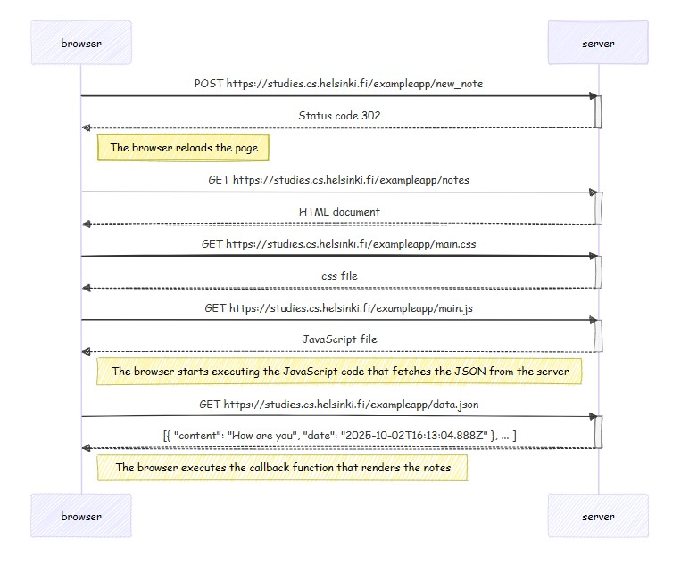
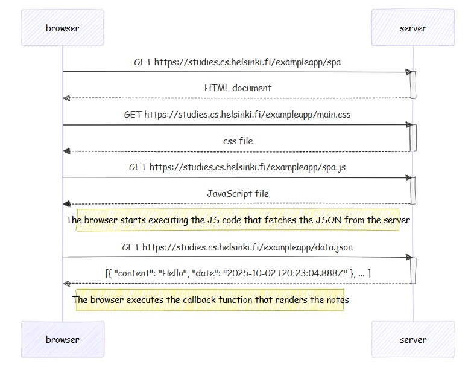
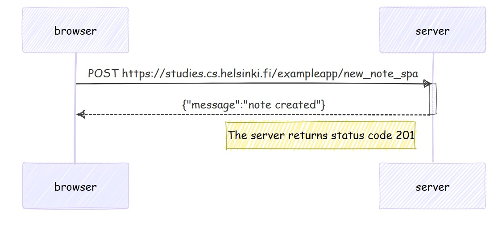

<h1><a href="https://fullstackopen.com/">FULLSTACKOPEN</a></h1>
<h1>Exercises</h1>

The repo is divided into different parts, each part containing the solution to the equivalent exercises of the course

 
<h2>Part 0</h2>
<h3>0.4: New note diagram</h3>

<h3>0.5: Single page app diagram</h3>

<h3>0.6: New note in Single page app diagram</h3>

